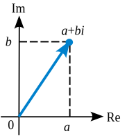
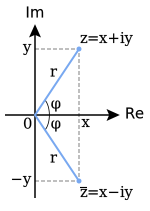

<section id="themes">
	<h2>Themes</h2>
		

			Set your presentation theme:  
			<!-- Hacks to swap themes after the page has loaded. Not flexible and only intended for the reveal.js demo deck. -->
                        <a href="#" onclick="document.getElementById('theme').setAttribute('href','css/theme/black.css'); return false;">Black (default)</a> -
			<a href="#" onclick="document.getElementById('theme').setAttribute('href','css/theme/white.css'); return false;">White</a> -
			<a href="#" onclick="document.getElementById('theme').setAttribute('href','css/theme/league.css'); return false;">League</a> -
			<a href="#" onclick="document.getElementById('theme').setAttribute('href','css/theme/sky.css'); return false;">Sky</a> -
			<a href="#" onclick="document.getElementById('theme').setAttribute('href','css/theme/beige.css'); return false;">Beige</a> -
			<a href="#" onclick="document.getElementById('theme').setAttribute('href','css/theme/simple.css'); return false;">Simple</a>  
			<a href="#" onclick="document.getElementById('theme').setAttribute('href','css/theme/serif.css'); return false;">Serif</a> -
			<a href="#" onclick="document.getElementById('theme').setAttribute('href','css/theme/blood.css'); return false;">Blood</a> -
			<a href="#" onclick="document.getElementById('theme').setAttribute('href','css/theme/night.css'); return false;">Night</a> -
			<a href="#" onclick="document.getElementById('theme').setAttribute('href','css/theme/moon.css'); return false;">Moon</a> -
			<a href="#" onclick="document.getElementById('theme').setAttribute('href','css/theme/solarized.css'); return false;">Solarized</a>
		

</section>

H:

# Quaternions

Jesus Felipe Chavarro Muñoz

H:

## Index

  1. Complex numbers
    - Definition
    - Geometric representation
    - Rotation

H: 

## Complex numbers

The complex pair $(a, b)$ defines the number $a+bi$, where $i$ is the so-called imaginary number such that $i^2 = –1$.

The set of complex numbers “live” in a 2D plane.

V: 

## Operations
#### sum

$$ (a+bi) + (c+di) = (a+c) + (b+d)i$$

#### multiplication

\\begin{aligned}
(a+bi) (c+di) &= ac + adi + bci + bdi^{2} \\\\ 
&= ac + (ad + bc)i + bd(-1) \\\\
&= (ac - bd) + (ad + bc)i 
\\end{aligned}

V:

## Conjugate

We can compute the conjugate of a complex number by negating the imaginary portion.
$$z = (x+yi)$$
$$\overline {z} = z^{*} = (x-yi)$$

V:

### Magnitude

\\begin{aligned}
\\lVert p \\rVert &= \sqrt {pp^{*}}  \\\\
\\lVert (a+bi) \\rVert &= \sqrt {(a+bi)(a-bi)} \\\\ 
\\lVert (a+bi) \\rVert &= \sqrt {a^{2}+b^{2}} \\\\
\\end{aligned}

V:

### Rotation

To perform a rotation, we define a second complex number $q = (\cos q, \sin q)$. Now, the rotated
vector $p'$ can be computed by the complex multiplication:

\\begin{aligned}
p &= (x+yi)  \\\\
q &= (\cos \theta + (\sin \theta)i)  \\\\
p'&= pq \\\\
  &= (x+yi)(\cos \theta + (\sin \theta)i) \\\\
  &= (x\cos \theta - y\sin \theta) + (x\sin \theta + y\cos \theta)i
\\end{aligned}

V:

### Matrix representation

Complex numbers $a + bi$ can also be represented by 2×2 matrices that have the following form:

$$P = \begin{pmatrix}a&-b\\\\b&a\end{pmatrix}$$

 - The squere of the magnitude $\\lVert p \\rVert$ is the determinant: $\lVert p \rVert^{2} = \det P$ . <!-- .element: class="fragment" data-fragment-index="1" -->
 - The conjugate corresponds to the transpose: $p^{*} = P^{T}$. <!-- .element: class="fragment" data-fragment-index="2" -->

H:

## Quaterions

